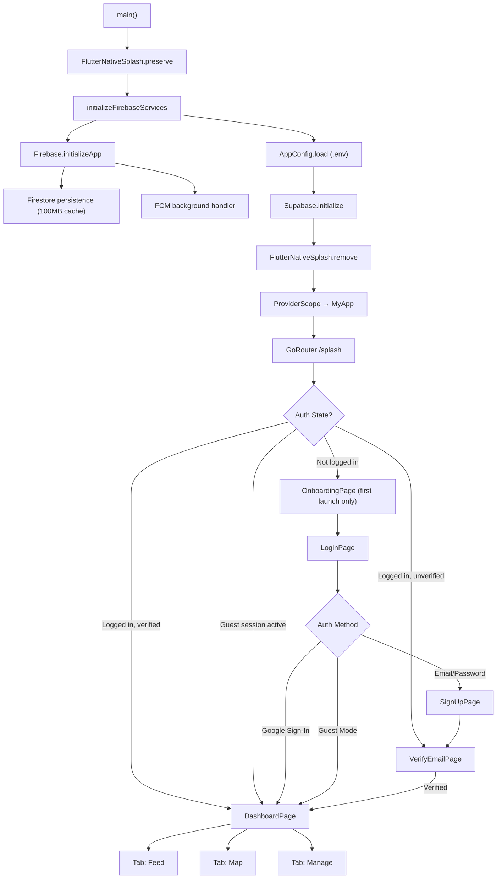
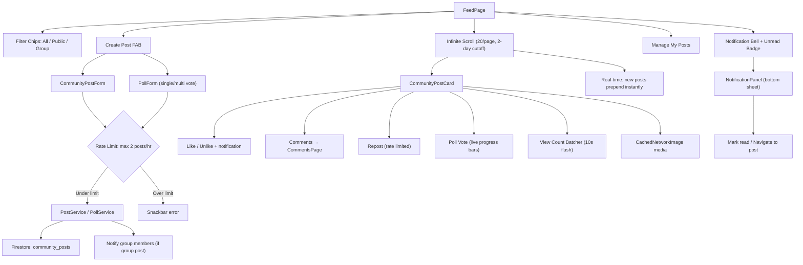
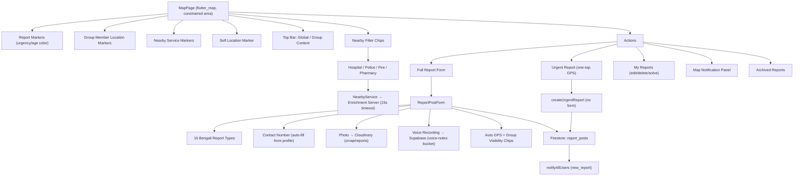
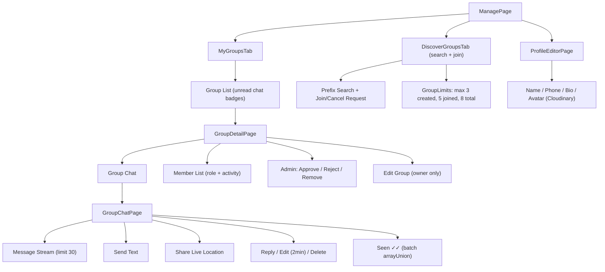
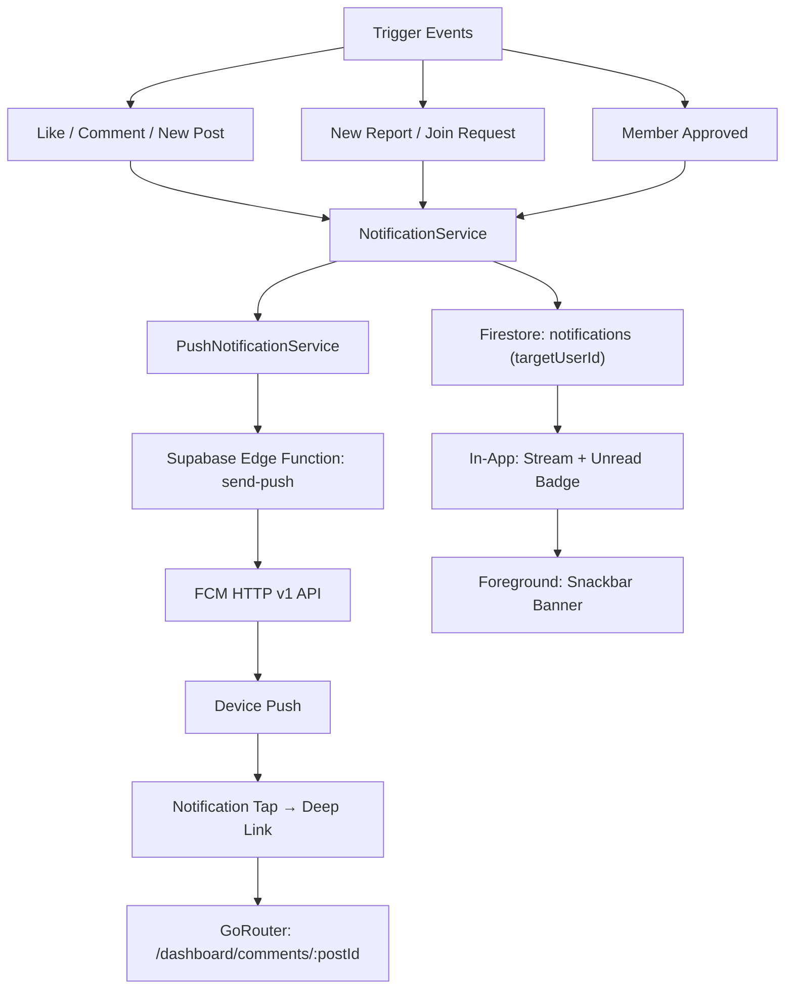
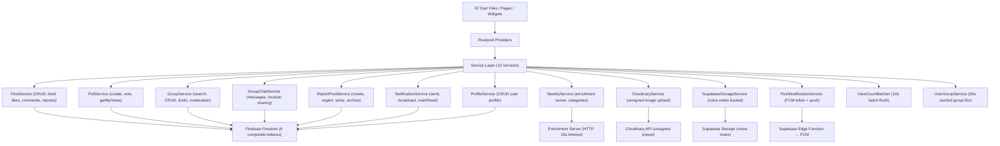
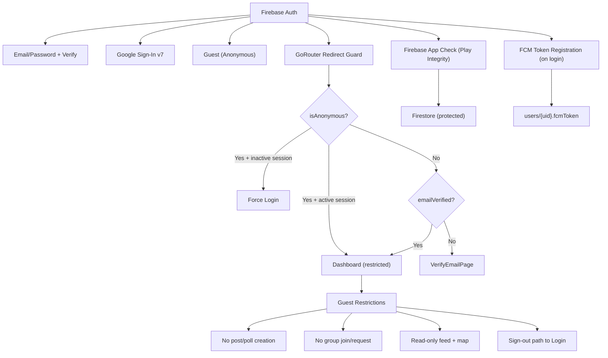

  
  <h1>Community Map</h1>

  

    <a href="#features"><b>Features</b></a> • 
    <a href="#use-cases"><b>Use Cases</b></a> • 
    <a href="#ui"><b>UI</b></a> •
    <a href="#legal"><b>Legal</b></a>
  

## Features

### Authentication & Access
- Email/password sign up and sign in
- Google sign-in support
- Guest access mode for read-focused exploration
- Email verification gate before full account access
- Password reset flow

### Feed & Community Content
- Infinite-scrolling community feed
- Post creation with title, description, and optional image
- Public posts and group-only posts
- Poll creation (single-choice and multiple-choice)
- Poll voting with live vote counts and progress indicators
- Reposts, likes, comments, and live view counts
- Per-user post management
- Feed filtering by public scope or joined groups

### Notifications
- Feed notification panel with unread count badge
- In-app foreground push banners
- Notification tap routing into relevant content

### Map & Reporting
- Interactive map with constrained service area and custom markers
- Report markers with urgency/age visual states
- One-tap urgent report submission
- Full report submission form with:
  - report type
  - contact number
  - description
  - optional photo attachment
  - optional voice recording
  - auto-detected location
- Nearby essential services discovery with category filters
- Report preview/detail sheets and archive access
- Personal report history with edit/delete/mark-solved actions

### Groups, Collaboration & Safety Network
- Group discovery with search
- Join request and cancel request flows
- Group creation and editing
- Group-level admin moderation:
  - approve/reject member requests
  - remove members
- Group member directory with activity visibility
- Group chat with unread counters
- Group location sharing for live member map presence
- Profile editing for personal identity and contact context

### Guest Experience Controls
- Guest-aware restricted access for management features
- Dedicated locked-state UI for unavailable actions
- Seamless guest sign-out path back to authentication

---

## Use Cases

### 1) Local Community Updates
A resident shares a neighborhood update as a public post, other members react/comment, and the discussion remains discoverable in the main feed.

### 2) Group-Scoped Coordination
A user posts updates only to a specific group (e.g., apartment block, volunteer team), keeping communication private to members.

### 3) Community Polling
A group admin or member creates a poll to make local decisions (event timing, priorities, actions), and members vote with transparent results.

### 4) Emergency Signaling
A user submits an urgent location-based report immediately from the map, enabling fast visibility for nearby community members.

### 5) Structured Incident Reporting
A user submits a detailed report with context, media, and location, then tracks progress and marks resolution when solved.

### 6) Nearby Assistance Discovery
During an incident, a user opens nearby service categories (hospital, police, fire, pharmacy) to quickly identify relevant help points.

### 7) Group Safety Coordination
Group members share their live location in group context, helping teams coordinate meetups, check-ins, or support response.

### 8) Member Onboarding & Trust
New users onboard with guided screens, verify email identity, and then join groups through moderated request workflows.

### 9) Lightweight Read-Only Exploration
A first-time visitor enters as a guest to explore feed/map content before creating an account.

### 10) Ongoing Group Administration
Group owners manage membership requests, monitor participation, and keep group communication organized through chat and moderation tools.

---

## UI

### Navigation Structure
- **Pre-auth flow:** Splash → Onboarding → Login/Signup → Verify Email
- **Post-auth root:** Dashboard with bottom navigation
  - **Feed**
  - **Map**
  - **Manage**

### Feed UI
- App bar with post management and notification access
- Horizontal filter chips (All/Public/Group scopes)
- Floating “Post” action with modal options (normal post or poll)
- Card-based post presentation with:
  - author identity
  - scope badge (public/group)
  - text/media content
  - interaction row (like/comment/repost/views)
- Comment route per post

### Post & Poll Creation UI
- Form-driven screens with validation
- Public vs group origin selectors
- Group picker when group origin is selected
- Image capture/gallery chooser for post media
- Poll builder with dynamic option list and vote type selector

### Map UI
- Full-screen interactive map canvas
- Top control bar:
  - global/group context dropdown
  - archive access
  - latest report notifications
- Nearby service filter chips under top bar
- Marker layers:
  - self-location
  - reports
  - group members
  - nearby services
- Bottom-left controls: reset view, jump to current location
- Bottom-right actions: my reports, urgent report, new report
- Bottom sheets for report preview/detail, member details, and nearby service details

### Report Submission UI
- Multi-section form with strong input affordances
- Media capture controls (photo + voice recording)
- Live location state card with refresh action
- Group visibility context chips for contact sharing

### Manage UI
- Tabbed interface:
  - **My Groups**
  - **Discover**
  - **Requests**
- Group list cards with unread/pending badges
- Group creation dialog
- Discover search bar with join/request state actions
- Pending requests list with cancel action

### Group Detail & Chat UI
- Group summary card with admin edit action
- Group chat entry point
- Admin review cards for pending join approvals/rejections
- Member list with role and activity cues
- Moderation menu for member removal
- Chat screen with message stream, timestamps, and send composer
- Quick action to share current location to group

### Profile & Identity UI
- Profile editor access from Manage
- Avatar/image pick actions
- Structured personal fields (name, contact, bio, etc.)

### Notification UI
- Feed notification panel and map notification panel as modal bottom sheets
- Badge counters in top app actions
- Snackbar-based in-app push feedback

---

## Legal

- [Terms and Conditions](/TERMS_AND_CONDITIONS.md)
- [Privacy Policy](/PRIVACY_POLICY.md)
- [License](/LICENSE)

---

## Architecture Flowcharts

### 1. App Lifecycle & Navigation

### 2. Feed Tab

### 3. Map Tab

### 4. Manage Tab

### 5. Notification System

### 6. Service & Data Layer

### 7. Auth & Security

